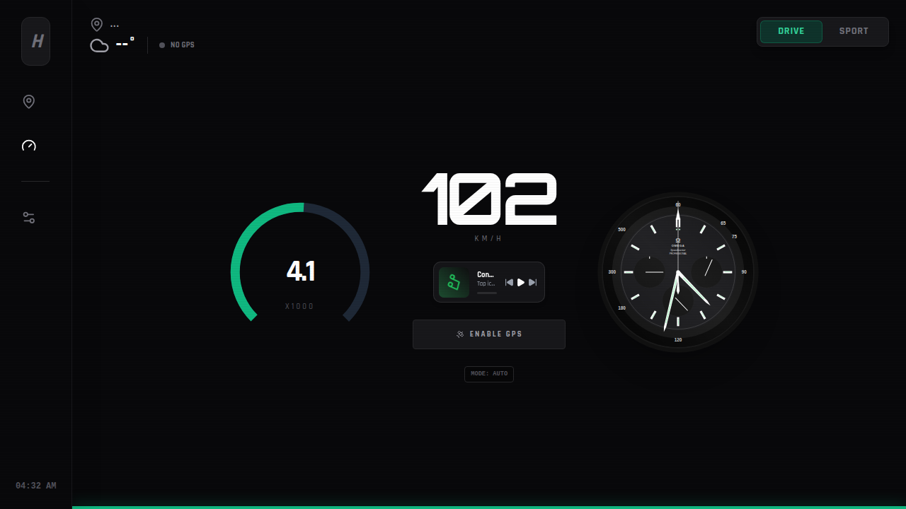
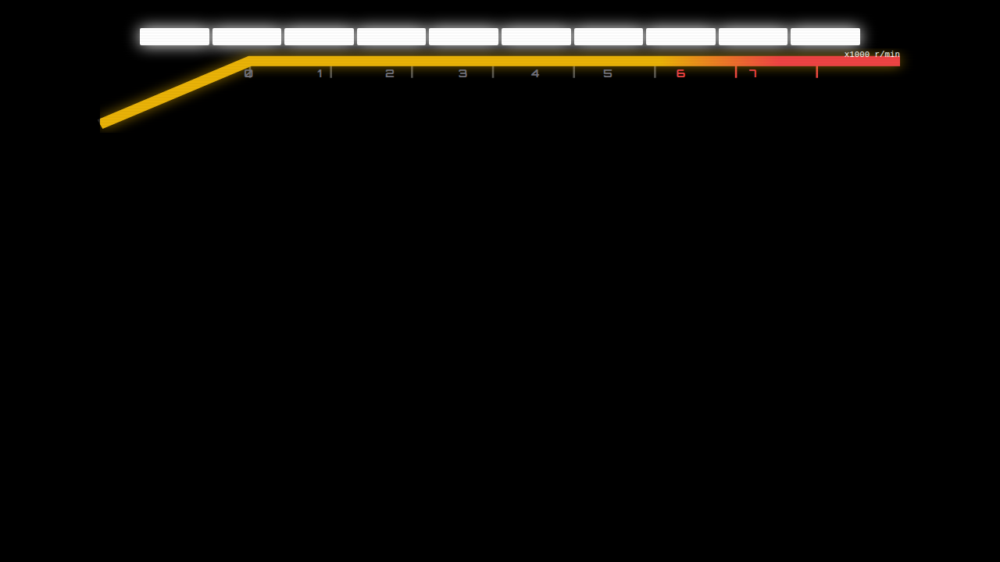

# SpeedDash

SpeedDash is a customizable, interactive speedometer dashboard application. It features multiple display modes to suit your driving style and visual preferences.

## Features

- **Intro Screen:** A sleek 2D animated introduction screen when launching the dashboard.
- **Normal Speedometer:** A clean, easy-to-read classic speedometer interface for everyday use.
- **Sport Mode:** A dynamic, high-performance display mode with aggressive styling.

## Screenshots

### Intro Screen

### Normal Speedometer

### Sport Mode

